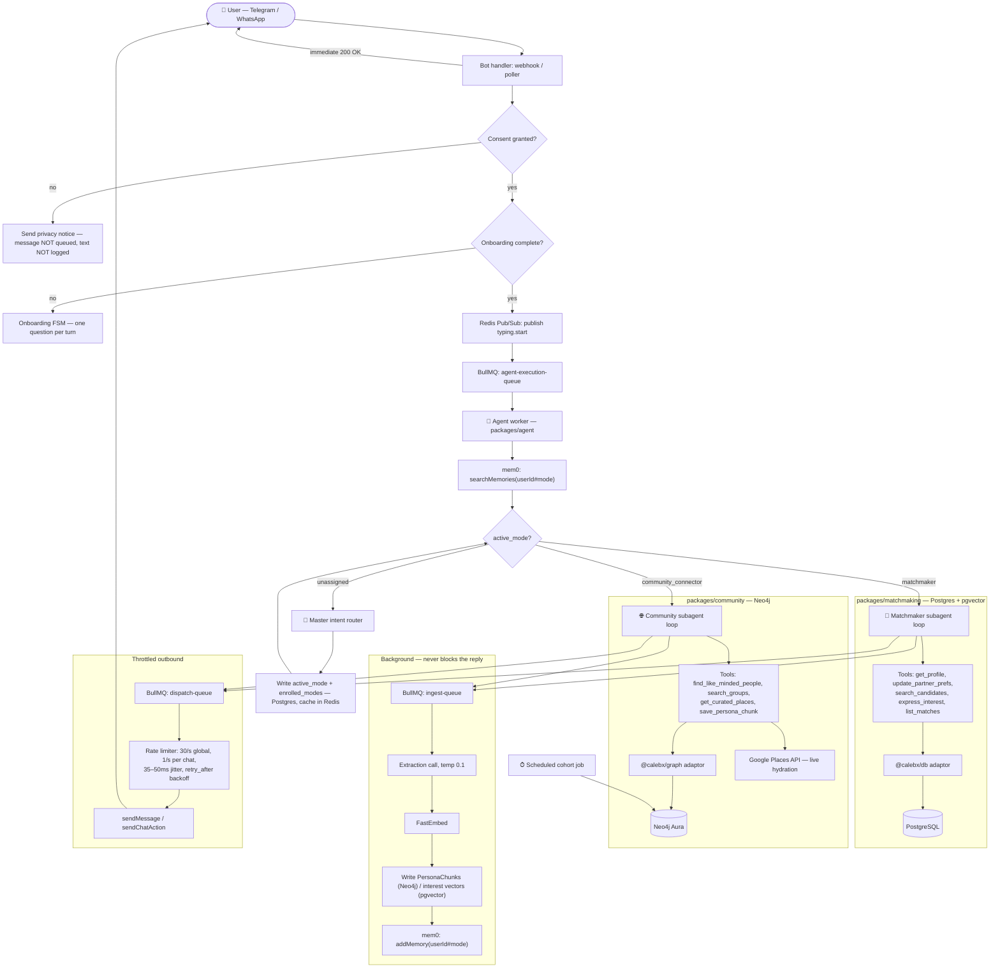

# CALEBX Agent Engine — Finalized Architecture & Implementation Plan

> **Status: finalized design, not yet built.** Supersedes the earlier Postgres+Redis-only
> draft of this file and expands **CLAUDE1.md** (which stays as the record of _rejected_
> designs and why). Verified against the repo on 2026-09-03: migrations stop at
> `008_candidate_consent.sql`, `form-bot.ts` writes to `@calebx/sheets`, `agent.ts:57`
> still discards Stage 1 extraction, `packages/config` has no `DATABASE_URL`.
> Once built, fold the real state into CLAUDE.md and reduce this file to a changelog.

---

## 0. What this adds to what exists

Today: consent gate → onboarding FSM → `runAgent` (mem0 search → extract-and-discard →
reply → mem0 write), inline and synchronous, no queue, no recommendations.

This plan adds: a **master intent router** assigning each user to one of two subagents,
**two domain packages** with their own tools and their own database, a **queue layer** so
the reply path stops blocking on embedding and graph work, and a **pull-triggered
recommendation flow**. It does not replace mem0 — mem0 remains conversational recall.

---

## 1. System architecture



---

## 2. Storage — separation of concerns

| Layer                 | Technology                       | Owns                                                                                                                                                  |
| --------------------- | -------------------------------- | ----------------------------------------------------------------------------------------------------------------------------------------------------- |
| Relational            | PostgreSQL (`@calebx/db`)        | Users, `active_mode` / `enrolled_modes`, per-mode consent, candidates, contact details, `partner_prefs`, matches, review tasks, cohort→group registry |
| Candidate similarity  | **pgvector** (same Postgres)     | Interest-text embeddings for matchmaking search                                                                                                       |
| Property graph        | Neo4j Aura (`@calebx/graph`)     | `PersonaChunk`, `KNOWS` 2nd-degree traversal, `MEMBER_OF`, `VISITED`, `communityId`                                                                   |
| Conversational memory | mem0 (`packages/agent`)          | Per-mode namespaced recall, injected every turn                                                                                                       |
| Queues + cache        | Redis (`@calebx/queue`)          | BullMQ queues, O(1) mode cache, typing Pub/Sub                                                                                                        |
| Place data            | Google Places API                | Names/addresses/coords — **fetched live, not stored** (§6.2)                                                                                          |
| Legacy form flow      | Google Sheets (`@calebx/sheets`) | `form-bot.ts` only — unchanged by this plan                                                                                                           |

**Rule:** one adaptor package per database. Domain packages import the adaptor concretely
(`packages/matchmaking` → `@calebx/db`, `packages/community` → `@calebx/graph`). No new
`core/` ports for these — decided deliberately, overriding CLAUDE1.md's "adapter satisfies
a core port" milestone. `packages/core` keeps only `IUserRepository`.

---

## 3. Mode model, router, and `/switch`

`assigned_mode` is **not** a one-way lock. The model is:

- `active_mode` — which subagent handles this user's turns right now.
- `enrolled_modes` — the set of modes this user has a profile _and_ a consent grant for.

Rules:

1. The router classifies on the first substantive message and sets `active_mode`.
2. **`/switch`** moves `active_mode` between modes. If the target mode isn't in
   `enrolled_modes`, the user first grants that mode's consent and completes that mode's
   profile — matchmaker collects contact details and biodata, community collects location
   and social graph. Different data practices, therefore **separate consent per mode**.
3. Boundaries do not leak. mem0 is namespaced `tg:123#matchmaker` / `tg:123#community`
   (mem0's `user_id` space is flat and `searchMemories` has no filter — without the
   suffix, matchmaking memories surface inside community replies).
4. Off-mode requests are declined **in persona**, never with an error. Matchmaker to a
   cafe question: acknowledge, steer back, mention `/switch` exists. Never contradict the
   user, and never state a preference change as fact without confirming it first.

---

## 4. Recommendations are pull-triggered

`/recommendation` is the single entry point to retrieval — matches in matchmaker mode,
groups/places/people in community mode. This replaces CLAUDE.md §4.1's "surface when it
feels natural" heuristic and its `≥3 chunks scoring > 0.75` threshold, neither of which
has any code.

**The agent triggers this path itself.** When a user asks for a recommendation in plain
language ("know anyone I'd click with?"), the system prompt instructs the agent to invoke
the recommendation flow rather than reply that a command exists — CALEBX does not tell
people to go type things. `/recommendation` is the explicit manual shortcut to the same
code path.

Implemented as a **deterministic path**, not a tool the model may forget: run retrieval →
hand the shortlist plus the user's chunks to the LLM to judge fit and narrate. Commands
registered via `setMyCommands` on Telegram; on WhatsApp the same words are matched as
plain text (no command UI exists there).

### 4.1 Matchmaker retrieval

Hard constraints in SQL, similarity only over soft text:

```
WHERE  candidate_state = 'active'
  AND  age BETWEEN :min AND :max
  AND  city = ANY(:cities)
  AND  marital_status = ANY(:allowed)
  AND  id <> :self
ORDER BY interest_embedding <=> :seeker_interest_embedding
LIMIT  :k
```

Both sides of the vector comparison are **interest text embedded by the same model** —
symmetric shapes, which is what makes cosine meaningful here. This is the correction
CLAUDE1.md's rejected-designs section was about: never embed a short preference sentence
against a multi-field biodata blob. Structured fields stay structured.

Then LLM rerank + narrate over the shortlist. Contact details are never revealed by the
agent; mutual interest files a human review task (§7).

### 4.2 Community retrieval

- **People** — 2nd-degree `KNOWS` traversal for the candidate set, then live
  `PersonaChunk`-to-`PersonaChunk` comparison to rank and explain. No `SIMILAR_TO` edge,
  no batch similarity job (CLAUDE1.md). **Requires the other person's opt-in** — see §6.3.
- **Groups** — `communityId` / tag-cohort match, then the stored invite link (§6.1).
- **Places** — Google Places Nearby Search filtered by the user's interest categories,
  then LLM rerank against their chunks. No vector index on Place or Group, ever.

---

## 5. Neo4j schema

```cypher
// Nodes
(:User { userId: "tg:123",              // namespaced, @calebx/channel scheme
         communityId: 7,                // written by the cohort job, nullable
         discoverable: true,            // §6.3 opt-in
         createdAt: 1756900000000, lastActive: 1756900000000 })

(:PersonaChunk { text: "prefers cafes for work",
                 embedding: [/* 384 */],
                 category: "interest",  // interest | location | social | sentiment
                 createdAt: 1756900000000 })   // immutable; decay computed on read

(:Place { placeId: "ChIJ...",           // the ONLY Google field we persist
          ourTags: ["work_cafe"], cachedAt: 1756900000000 })

(:Group { groupId: "-1001234567890",    // real Telegram chat id
          title: "Delhi Cafe Crawlers",
          cohortKey: "cafe:delhi",
          inviteLink: "https://t.me/+...",
          category: "social", memberCount: 12 })

// Relationships
(:User)-[:HAS_CHUNK]->(:PersonaChunk)
(:User)-[:KNOWS { strength: 0.8 }]->(:User)
(:User)-[:VISITED { count: 4, lastVisitedAt: 1756900000000 }]->(:Place)
(:User)-[:MEMBER_OF { joinedAt: 1756900000000 }]->(:Group)

// Constraints + indexes
CREATE CONSTRAINT user_id      IF NOT EXISTS FOR (u:User)  REQUIRE u.userId  IS UNIQUE;
CREATE CONSTRAINT group_id     IF NOT EXISTS FOR (g:Group) REQUIRE g.groupId IS UNIQUE;
CREATE CONSTRAINT place_id     IF NOT EXISTS FOR (p:Place) REQUIRE p.placeId IS UNIQUE;
CREATE VECTOR INDEX chunk_vec  IF NOT EXISTS FOR (c:PersonaChunk) ON c.embedding
  OPTIONS { indexConfig: { `vector.dimensions`: 384, `vector.similarity_function`: 'cosine' } };
```

**Deviations from CLAUDE1.md, and why:**

- `Place` loses its `Point` and `name`/`city` — Google Places terms permit storing
  `place_id` indefinitely but not caching names/coords beyond ~30 days, and prohibit
  building a derived catalog. Geo-radius therefore happens in Nearby Search, not
  `point.distance()`. Switch to Foursquare or OSM/Overpass later if an owned catalog with
  real spatial indexing is wanted.
- `Group` carries `inviteLink` + `cohortKey`, because a bot cannot create groups (§6.1).
- `decayWeight` is dropped as a stored property — computed at read time from `createdAt`,
  so there is no decay cron and no write amplification. Chunks stay immutable.

---

## 6. The two things that constrain the product

### 6.1 A Telegram bot cannot create a group

No Bot API method exists; group creation requires a user account, i.e. MTProto, which
CLAUDE.md §6.3 bans. The flow is therefore:

```
cohort job detects "cafe:delhi" with ≥ N members and no Group
      → insert review_task(kind='create_group', cohort_key='cafe:delhi')
      → admin creates the group, adds the bot as admin
      → admin runs /register_group in that chat
      → bot reads chat id + title, calls createChatInviteLink, stores Group node
      → invite link is now reusable for every future member of that cohort
```

Per-user invite links (`createChatInviteLink`) are revocable and let us confirm joins via
`chat_member` updates, so `MEMBER_OF` edges are written from real events, not assumptions.

### 6.2 Place data is API-owned, not ours

`Place` nodes are identity + our own tags only. Every recommendation hydrates name,
address, and coordinates live from Places at query time. Nothing user-visible is served
from a stale cache.

### 6.3 Introducing people needs the other person's consent

The bot may not DM someone who hasn't started a conversation. So person recommendations
require:

1. A `discoverable` opt-in, collected in the community mode's consent step
   (copy lives in `packages/channel`, not in a bot package).
2. A → anonymized card only: interests, rough area, shared connections count. No name,
   username, or photo.
3. Contact exchange only after B accepts. Both sides' acceptance is a `review_task` if a
   human is in the loop, or a direct bot-mediated handshake if not.

---

## 7. Human-in-the-loop

**Default (override if you want it in the Sheet):** a Postgres `review_tasks` table plus an
admin Telegram chat the bot posts into, with inline Approve/Decline buttons. One surface
carries all task kinds: `create_group`, `mutual_interest`, `contact_share`,
`agent_escalation`.

The **user's conversation never blocks** on a pending review — the agent says the request
is being looked at and keeps talking. The coordinator's decision comes back to the user as
a `dispatch-queue` job, never a manual DM from a human account.

---

## 8. Queues

| Queue                 | Payload                                            | Work                                                            | Concurrency          | Retries                  |
| --------------------- | -------------------------------------------------- | --------------------------------------------------------------- | -------------------- | ------------------------ |
| `agent-execution`     | `{ userId, text, channel, chatId, correlationId }` | router → subagent tool loop → reply                             | 5                    | 3, exponential           |
| `ingest`              | `{ userId, mode, text, reply, correlationId }`     | extraction (temp 0.1) → FastEmbed → chunks/vectors → mem0 write | 5                    | 3, exponential           |
| `dispatch`            | `{ chatId, text, parseMode, kind }`                | rate-limited send                                               | **1** (global limit) | 5, honours `retry_after` |
| `cohort` (repeatable) | —                                                  | tag cohorts, then graphology Louvain                            | 1                    | 1                        |

Notes:

- **Extraction runs in `ingest`, after the reply is dispatched.** The user never waits on an
  LLM extraction call or an embedding pass. This is what finally consumes `agent.ts:57`'s
  discarded `{intents, entities, sentiment, location_hint}`.
- **Consent runs before enqueueing.** Unconsented text is never queued and never logged.
- Tool loop is capped at **4 iterations** per turn. The one-question-per-turn rule is
  enforced on the _final_ assistant message, not per iteration.
- Dead-lettered jobs must enqueue a `dispatch` job with a graceful fallback. A failed turn
  still owes the user a reply (`copy.AGENT_UNAVAILABLE`).

### 8.1 Typing indicator

`typing.start` / `typing.stop` on a Redis Pub/Sub channel. A subscriber re-sends
`sendChatAction` every ~4s (it expires at ~5s) until stop. Two constraints: chat actions
**count against Telegram's rate limits**, so the typing loop draws from the same 30/s
budget through the same limiter; and WhatsApp Cloud API has no typing action, so this bus
is Telegram-only.

### 8.2 Cohort job

`graphology` + `graphology-communities-louvain` (MIT, in-process JS) — one Cypher query
pulls the `KNOWS` / shared-interest subgraph, Louvain runs in the worker, `communityId` is
written back. Keeps hosted AuraDB Free; no GDS plugin, no AuraDS, no Python sidecar.

**Ship tag cohorts first.** `category + city → cohortKey` produces "cafe likers in Delhi"
reliably at 20 users, where Louvain returns one blob or singletons. Louvain takes over
behind the same `communityId` property once `KNOWS` is dense enough — nothing downstream
changes when it does.

---

## 9. Embeddings

- **FastEmbed**, `bge-small-en-v1.5` → **384 dimensions**. Small, fast, well-matched to
  short interest text, and 384-dim vectors are materially cheaper in both the pgvector
  column and the Neo4j vector index. (Verify the exact model enum in `fastembed-js` when
  wiring; the old CLAUDE.md's `[F32; 1024]` was wrong for nomic regardless.)
- The dimension is baked into `CREATE VECTOR INDEX` **and** the pgvector column type.
  Changing models later means reindexing both.
- **One shared embedding service**, not in-process per worker — a single model in memory
  instead of one copy per replica, and a warm ONNX model cache. It is the ingest queue's
  only synchronous dependency.

---

## 10. Migration 009

`packages/db/src/migrations/009_agent_modes_and_community.sql` (008 is current head):

```sql
CREATE EXTENSION IF NOT EXISTS vector;           -- fails loudly if the host lacks pgvector

CREATE TYPE agent_mode AS ENUM ('matchmaker', 'community_connector');
CREATE TYPE review_kind AS ENUM ('create_group','mutual_interest','contact_share','agent_escalation');
CREATE TYPE review_state AS ENUM ('open','approved','declined');

CREATE TABLE agent_users (
  user_id          text PRIMARY KEY,             -- namespaced: "tg:123"
  active_mode      agent_mode,
  enrolled_modes   agent_mode[] NOT NULL DEFAULT '{}',
  created_at       timestamptz NOT NULL DEFAULT now(),
  last_active      timestamptz NOT NULL DEFAULT now()
);

CREATE TABLE mode_consent (
  user_id     text NOT NULL REFERENCES agent_users(user_id) ON DELETE CASCADE,
  mode        agent_mode NOT NULL,
  granted_at  timestamptz NOT NULL DEFAULT now(),
  PRIMARY KEY (user_id, mode)
);

ALTER TABLE candidates ADD COLUMN interest_text      text,
                       ADD COLUMN interest_embedding vector(384);
CREATE INDEX candidates_interest_hnsw ON candidates
  USING hnsw (interest_embedding vector_cosine_ops);

CREATE TABLE review_tasks (
  id          uuid PRIMARY KEY DEFAULT gen_random_uuid(),
  kind        review_kind  NOT NULL,
  state       review_state NOT NULL DEFAULT 'open',
  user_id     text,
  payload     jsonb NOT NULL DEFAULT '{}',
  created_at  timestamptz NOT NULL DEFAULT now(),
  resolved_at timestamptz
);

CREATE TABLE cohort_groups (
  cohort_key   text PRIMARY KEY,                 -- "cafe:delhi"
  group_id     text UNIQUE,                      -- Telegram chat id, null until registered
  invite_link  text,
  created_at   timestamptz NOT NULL DEFAULT now()
);
```

---

## 11. Sheets → Postgres

The matchmaker subagent searches Postgres, but the curated biodata pool lives in the Sheet
(`directory-import` writes there) and `form-bot.ts` keeps writing to it.

**Default: one-shot import now, plus a periodic one-way sync job** (Sheets → Postgres,
idempotent on a stable candidate key, never writing back). Without the ongoing sync, every
`form-bot` signup after import day is invisible to the matcher. `form-bot` may be repointed
at Postgres later, which is when Sheets goes read-only — out of scope here.

---

## 12. `/forget`

Currently clears the consent and onboarding files and **nothing else**. After this plan it
must clear, behind an explicit "this cannot be undone" confirmation:

1. mem0 — **both** namespaces (`#matchmaker`, `#community`)
2. Neo4j — `User` node and all `HAS_CHUNK` / `KNOWS` / `VISITED` / `MEMBER_OF` edges
3. Postgres — `agent_users`, `mode_consent`, candidate row + embedding, open `review_tasks`
4. Redis — mode cache and any session keys
5. The consent and onboarding files

Deleting `agent_users` resets mode assignment, so the router re-runs on the next message.

---

## 13. Config

Keep `packages/config`'s namespaced `env(ns)` helper — `loadConfig()` is deliberately not a
module-load side effect, and one mega-schema would force every entry point to satisfy every
var. New namespaces: `env("db")`, `env("graph")`, `env("queue")`, `env("places")`,
`env("embed")`.

Delete as dead: `HELIX_URL`, `OLLAMA_URL`, `OLLAMA_CHAT_MODEL`, `OLLAMA_EMBED_MODEL`,
`PERSONA_CHUNK_THRESHOLD`. Add: `DATABASE_URL`, `NEO4J_URI` / `NEO4J_USER` /
`NEO4J_PASSWORD`, `REDIS_URL` (now real), `GOOGLE_PLACES_API_KEY`, `EMBED_SERVICE_URL`,
`ADMIN_CHAT_ID`.

---

## 14. Phases

**Phase 1 — Foundation**
`009` applied with pgvector live · `@calebx/graph` adaptor connects to Aura, constraints and
vector index created · embedding service returns a 384-vector · config namespaces added,
dead vars gone · consent and onboarding stores moved off files onto Postgres (file-backed
state stops being coherent the moment workers are distributed).
_Exit:_ `bun run migrate` clean, a script writes and reads back one `PersonaChunk`.

**Phase 2 — Domain packages**
`packages/matchmaking` (tools + SQL/pgvector retrieval + matchmaker persona) ·
`packages/community` (Cypher tools + Places client + community persona) · Sheets→Postgres
importer + sync job.
_Exit:_ each tool callable from a unit test against a real dev database, no bot involved.

**Phase 3 — Orchestrator**
Master router + `active_mode`/`enrolled_modes` + per-mode consent + `/switch` · 4-iteration
tool loop · mem0 namespacing · `/recommendation` deterministic path, agent-triggered ·
`review_tasks` + admin chat + `/register_group`.
_Exit:_ a locked matchmaker user asking for a cafe is steered in persona; `/switch` enrolls
into community with its own consent; `/recommendation` returns narrated results in both.

**Phase 4 — Queues & dispatch**
`packages/queue` with all four queues · rate limiter (30/s global, 1/s per chat, 35–50ms
jitter, `retry_after`) · typing Pub/Sub sharing the limiter budget · dead-letter → fallback
dispatch · both bots enqueue instead of calling `runAgent` inline · `/forget` wipes all five
stores.
_Exit:_ reply latency no longer includes extraction or embedding; a killed worker mid-turn
still results in a user-visible reply.

**Phase 5 — Verification**
`/switch` and per-mode consent boundaries · mem0 namespace isolation (no matchmaking memory
in a community reply) · 2nd-degree `KNOWS` recommendations against seeded data · cohort job
producing a `cohortKey` and surviving the Louvain swap · rate limiter and jitter under mock
load including typing traffic · `/forget` verified against all five stores.

---

## 15. Carried-over debt this plan does not fix

- `packages/errors` is defined but never thrown. Direction: adopt it in the new packages
  (`HelixDBError` → `Neo4jError`/`PostgresError`) rather than adding more ad-hoc try/catch.
- `packages/logger` is used in exactly one file. New workers should use it — every entry
  needs `correlationId`, `userId`, `jobId`, `phase`. No drive-by migration of existing files.
- `packages/types` stays dead code. Don't add to it.
- `docs/architecture.md` and root `README.md` still describe HelixDB/Ollama/BullMQ as live.
- mem0 stores raw message + reply pairs, not just extracted facts — a real divergence from
  the original privacy design. Unchanged here; state it accurately to users.

## 16. Still open

- **Human-review surface** — defaulted to `review_tasks` + admin Telegram chat (§7).
  Say so if you'd rather coordinators work in the existing Sheet.
- **Group creation** — defaulted to admin-creates + `/register_group` (§6.1). The
  alternative is a pre-created pool of empty groups the bot claims and renames.
- **Postgres host** — must support `CREATE EXTENSION vector` (Neon/Supabase/RDS do).
